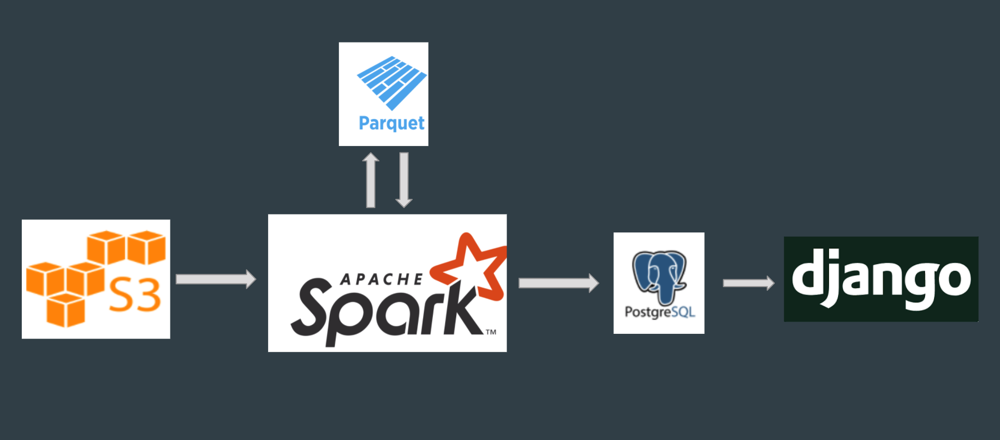

# Strategy Recommender for DOTA 2
Surfacing investment opportunities
<!-- TOC -->

- [Strategy Recommender for DOTA 2](#Strategy Recommender for DOTA 2)
  - [1. PROJECT ARTIFACTS](#1-project-artifacts)
  - [2. INTRODUCTION](#2-introduction)
  - [3. DATASETS](#3-datasets)
  - [4. ARCHITECTURE](#4-architecture)
    - [4.1 Environment Setup](#41-environment-setup)
    - [4.2 Data Ingestion](#42-data-ingestion)
      - [4.2.1 Amazon AWS S3](#421-amazon-aws-s3)
    - [4.3 Batch Processing](#43-batch-processing)
      - [4.3.1 Apache Spark](#431-apache-spark)
      - [4.3.2 PostgresSQL](#432-postgressql)
    - [4.4 User Interface](#44-user-interface)
      - [4.4.1 Django](#441-django)
  - [5. ENGINEERING CHALLENGES](#5-engineering-challenges)

<!-- /TOC -->

## 1. PROJECT ARTIFACTS
* [Demostration URL]
* [Presentation Slide]
* [Demostration vedio]

## 2. INTRODUCTION
Dota 2 is a multiplayer online battle arena (MOBA) video game developed and published by Valve. Dota 2 is played in matches between two teams of five players, with each team occupying and defending their own separate base on the map. Each of the ten players independently controls a powerful character, known as a "hero", who all have unique abilities and differing styles of play.    

As Dota 2 has 119 unique heroes, it's really hard for beginners to choose the right one to win a game. This project will use historical data to provide hero suggestions for beginners which can make the game more easier and help players more focus on the game operation.

## 3. DATASETS
* [Dota 2 Data Set](http://academictorrents.com/details/0ddf777978c0669b52fadd1baa9e256a6d8b3996)     

  The Dota 2 Data Set contains information in JSON format downloaded from Torrent files that record and store users and matches  statistics in March 2016. With the all the matches info, we are able to provide personalized suggestions for beginners about heroes' choice in different skill level. However, only the data from Mar 2016 will be used in this project.

## 4. ARCHITECTURE

### 4.1 Environment Setup
 For environment configuration and tools setup, please refer to [SETUP.md](./SETUP.md).
### 4.2 Data Ingestion
#### 4.2.1 Amazon AWS S3      
  AWS S3 is a way for long term storage. The data file was first downloaded and uncompressed to an EC2 instance. Then I used AWS CLI to upload the a sample data to AWS S3 bucket, which is a JSON file around 62GB.
### 4.3 Batch Processing
#### 4.3.1 Apache Spark      
  Apache Spark is a fast and general-purpose cluster computing system. In this project, Spark was used to process batch of historical data. Parquet was integrated in spark job to save temporary data as intermediate storage to reduce the data reading time.     
  After data cleaning, the target data was stored in PostgresSQL.
  The detailed data processing steps for data in spark is as follows:
  * Step1:

  * Step2:

  * Step3:

  * Step4:


#### 4.3.2 PostgresSQL       
  To reduce the number of data in database, the results of data processing only include a particular professional game in 2016,  which is used for groupBy and other operation. While detailed information of matches and players are stored in other tables.   

  * hero picks table:     
    Store picks info in a professional game
    ```postgresql
    picks:
      -- match_id         TEXT
      -- radiant_win   BOOLEAN
      -- picks          ARRAY
    ```
  * cik_company table:      
    Store matches and players info.
    ```postgresql
    match_player:
      -- match_id    TEXT
      -- user_id   TEXT
      -- other info   TEXT
    ```   

* Airflow       
  Scheduling and monitoring workflow of downloading data to s3 and spark batch processing.
### 4.4 User Interface
#### 4.4.1 Django     
  Front-end application to provide strategy suggestions during a time period. Connection between pipeline users and the PostgreSQL database.
## 5. CHALLENGES
* Recommendation solutions     
  The goal of this project is to help beginners choose heroes so that they have better experience. So, the Recommendation solutions should be the core part. I combined three different ways to recommend heroes including rank based, content based and user-user based.

  For the rank based solution, we can recommend the most popular heroes when we don't have users' info or in the first turn of hero pick stage.

  For the combination solution, we can use the existing picks to recommend the hero combinations that with the highest win rate.

  For the user-user solution, we can recommend other players' favorite hero who has the same skill level as you.
